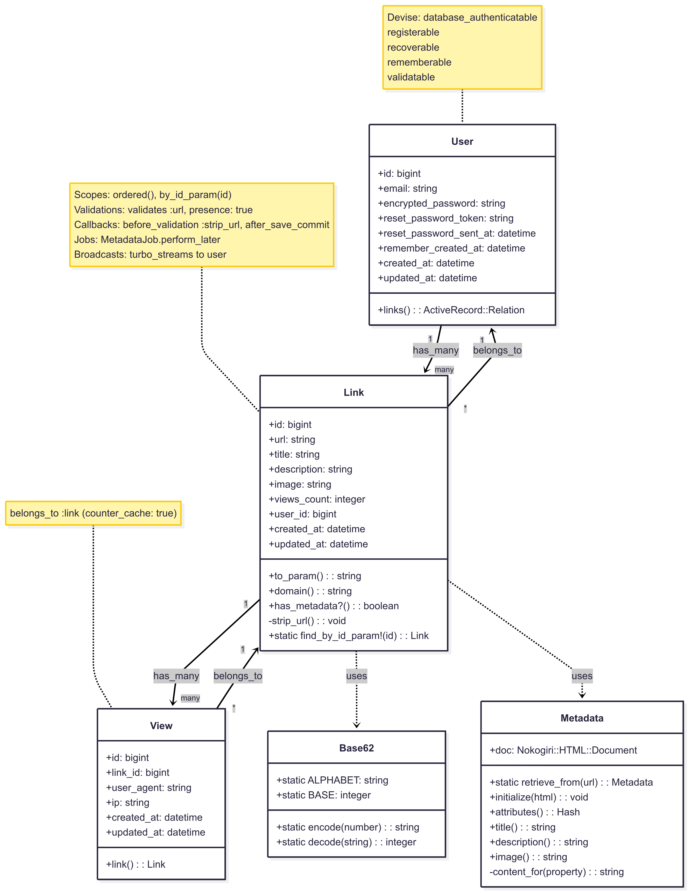
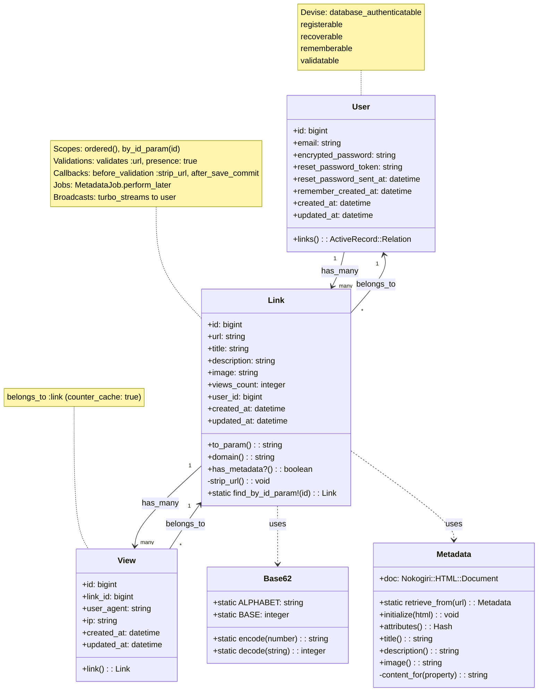

# URL Shortener

## Requirements
- Submit a URL from a form on the homepage.
- Save the URL to the database.
- Expose a Base62-encoded short code for redirects at `/v/:code` (derived from the primary key).
- Allow the user to copy the short URL to the clipboard.
- When visiting the short code:
  - Record a view (with timestamp) to track daily views.
  - Increment a `views_count` counter on the URL record.
- Show a graph of daily views for the past 14 days.
- Allow users to edit and delete a URL.
- Retrieve the page metadata (title, description, Open Graph image).
  - This should run in the background to keep the app fast.
  - If the destination URL is edited, refresh the metadata.
- Paginate the list of shortened URLs.

## Tech Stack
- **Backend**: Ruby 3.3, Rails 8.0.2, PostgreSQL 16+
- **Frontend**: Hotwire (Turbo + Stimulus), Tailwind CSS
- **Server**: Puma
- **Dependencies**: Managed with [Bundler](http://bundler.io/)

## Setup

```bash
bundle install
bin/rails db:prepare
```

## Run

```bash
bin/dev
```

## Test

```bash
bin/rails test
```

## Architecture Overview


<details>
<summary>View diagram source code</summary>



</details>

## Key Features
- **URL Shortening**: Base62 encoding for compact URLs
- **Metadata Extraction**: Background job fetches title, description, and images
- **Real-time Updates**: Turbo Streams for live UI updates  
- **Analytics**: View tracking with daily graphs
- **Authentication**: Devise integration for user management

## Models
- **User**: Authentication and link ownership
- **Link**: Core URL shortening with metadata
- **View**: Analytics tracking per visit
- **Base62**: ID encoding utility
- **Metadata**: Web scraping for previews